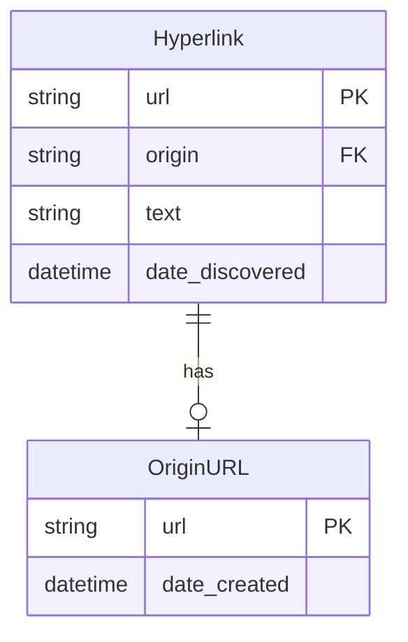

# wp-crawler

## Context and overview

This project is my answer to [the technical test for WP Media](https://docs.google.com/document/d/1WMIKIARny9dcObg6VjBh1WE2TSAWDV6GeMq9PKXodWE/edit#heading=h.6j7s2nur8cpr).

It is a python app, based on Django framework that "crawls a URL": 
- retrieve  the corresponding HTML file,
- list all hyperlinks in it,
- build a sitemap file

All those elements are stored, as files or within a database.

All crawled URLs are registered and a new crawl is scheduled every hour.

Two back-office interfaces are available:
- A (very basic) custom page to manage the app, 
- The Django admin page.

## Getting started

- Install all requirements

<code>pip install -r requirements.txt</code>

- Migrate

<code>python manage.py migrate</code>

- Create a super-user

<code>python manage.py createsuperuser</code>

- Access the back-office page from a browser

<code>http://127.0.0.1:8000/hyperlist/home/</code>

- Enter a valid URL in the text bar (example: http://www.google.com) and click "Crawl and schedule".

- You should see the results as a sitemap, as well as a new "www.google.com" line in **Stored crawl results**.

## Functional overview

The app provides a basic back-office interface that allows logged users to request a crawl, display the results of this crawl, as well as serving the user with all previous crawl results.

Every hour, all registered URL are crawled again and results are updated.

## Technical Architecture

The project is composed of two apps:
- <code>scheduler</code> handles the scheduled jobs exectuion.
- <code>hyperlist</code>
 handles the crawls and their results.

<em>In the following, only the <code>hyperlist</code> app will be detailed, as it contains the main logic of the project.</em>

<code>hyperlist</code> is built according to the MVC model:
- The **model** is mostly described by <code>service.py</code> (for the back-end logic)
 and <code>models.py</code> (for the data layer).
- The **views** are described by the <code>templates</code> folder and handles the display to users.
- The *controller** is described by <code>views.py</code>.

### Model

The **model** describes the logic to perform crawls and to manage the results. The core of this functionality is handled by the <code>crawl</code> function, which performs the following actions:
- Retrieve HTML from the URL, (<code>get_soup_from_url</code>)
- Find hyperlinks in the page, (<code>find_hyperlinks_in</code>)
- Store the results in database and in files (<code>store_crawl</code>).

Those functions as well as others to handle crawls and results are described within <code>service.py</code>, which contains the processing logic and well as file storage management.

#### Data model

The data logic linked to the databases is described in <code>models.py</code>

- <code>Hyperlink</code> model registers a hyperlink found during a crawl and links it to the URL in which it was found.
- <code>OriginURL</code> model registers a URL that has been crawled (and that is registered for the automatic crawls).

<em>Note: uuid management for PK should be added, instead of relying on URLs as strings.</em>

<em>Note: the foreign key link between the hyperlink and the originURL models is not enforced beteen tables.</em>

### Views

- The <code>home</code> HTML file describes the main view of the back-office. It can be composed of several parts, depending on the context returned by the **controller**:
    - (<code>create_crawl_form</code>) the crawl form to request a crawl, perform it, store the results and add the URL to the scheduled crawls.
    - (<code>crawl_result</code>) Results from the requested crawl, if any.
    - (<code>stored_results</code>) List of all available crawl results.
- The <code>sitemap</code> HTML file describes the structure of a sitemap.html file. It is used to display results of a crawl and to build the stored sitemap.html files.
- The <code>registration</code> folder contains templates for the login and logout pages, as the <code>hyperlist</code> back-office is behind admin login.

### Controller

- (<code>/hyperlist/home/</code>) The <code>HomeView</code> handles the access to the main back-office page, including the crawl creation form, the result of the last crawl and the list of all available stored results. This controller requires the user to be logged in;
    - GET: Used to access the home view without performing a crawl.
    - POST: Used to perform a crawl and access the home view with the results displayed.

- (<code>/hyperlist/download_stored_file/</code>) The <code>DownloadStorageFileView</code> serves stored files for the user to download them. It allows logged in users to access any file in the <code>storage</code> folder on the server.

## Coding guidelines

The <code>hyperlist</code> app has been validated by <code>Pylint</code> against PEP8 guidelines.

## Next steps

This section lists the main improvements that remain to be implemented.

### Functional improvements
- Option to keep only internal links during crawls, to avoid external links in sitemap files.
- Implement recursive crawls to scan a whole website.
- Don't store sitemap.html files but generates them on-the-fly from the database.

### Technical improvements
- uuid for databases.
- Enforce foreign key relationship.
- Improve test coverage (only some tests have been implemented to pave the way).